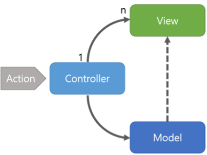
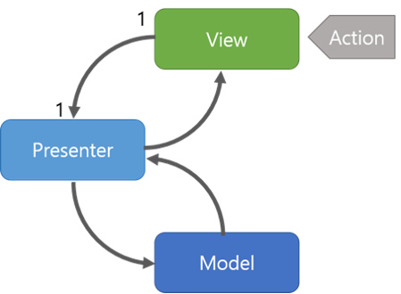
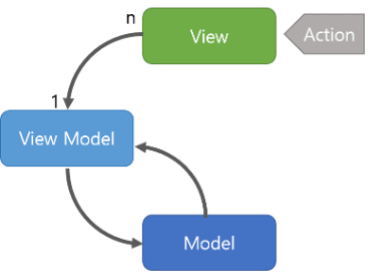

# Software Design Architecture

## Introduction

An architectural pattern is a general, reusable resolution.<br>
By following architectural pattern, you would be able to improve system's scalability, performance, and maintainability.

## MVC (Model - View - Controller)

- **Model** - This component stores the <span style="background-color:yellow">**application data.**</span> It has no knowledge about the interface. The model is responsible for handling the <span style="background-color:yellow">**domain logic(real-world business rules)**</span> and communication with the <span style="background-color:yellow">**database and network layers**</span>.

- **View** - It is the <span style="background-color:yellow">**UI(User Interface)**</span> layer that holds components that are visible on the screen. Moreover, it provides the visualization of the data stored in the Model and offers interaction to the user.

- **Controller** - This component establishes the relationship between the View and the Model. It contains the <span style="background-color:yellow">**core application logic**</span> and gets informed of the <span style="background-color:yellow">**user’s response**</span> and updates the Model as per the need.

### Strength

1. **Separation of Concerns**: MVC separates the application into three components, making it easier to manage and maintain.
2. **Widely Adopted**: MVC is a well-known and widely adopted pattern, making it easier for developers to understand and work with existing codebases.

### Weaknesses

1. **Complexity**: MVC can become complex, especially in large applications, making it challenging to manage.
2. **Synchronization**: In some cases, synchronization between the Model and View can be difficult to manage.
3. **Tight Coupling**: Views are often tightly coupled to controllers, which can lead to maintenance issues and make it harder to reuse code.

 <br>

## MVP (Model - View - Presenter)

- **Model** - Layer for <span style="background-color:yellow">**storing data.**</span> It is responsible for handling the <span style="background-color:yellow">**domain logic(real-world business rules)**</span> and communication with the <span style="background-color:yellow">**database and network layers.**</span>

- **View** - <span style="background-color:yellow">**UI(User Interface)**</span> layer. It provides the visualization of the data and keep a <span style="background-color:yellow">**track of the user’s action**</span> in order to notify the Presenter. <br>

  By Isolating UI Logic, MVP enables the View to focus strictly drawing visuals for cleaner code, testing

- **Presenter** - <span style="background-color:yellow">**Fetch the data**</span> from the model and <span style="background-color:yellow">**applies the UI logic**</span> to decide what to display. It <span style="background-color:yellow">**manages the state of the View**</span> and takes actions according to the user’s input notification from the View. <br>

### Strength

1. **Testability**: MVP makes it easier to test the presenter and the view independently, enhancing overall testability.
2. **Reduced Coupling**: Presenters in MVP act as intermediaries between the View and the Model, reducing coupling between these components.

### Weaknesses

1. **Complexity**: Like MVC, MVP can become complex, especially in large applications.

 <br>

## MVVM (Model — View — ViewModel)

- **Model** - Layer for <span style="background-color:yellow">**storing data.**</span> It is responsible for handling the <span style="background-color:yellow">**domain logic(real-world business rules)**</span> and communication with the <span style="background-color:yellow">**database and network layers.**</span>

- **View** - The purpose of this layer is to <span style="background-color:yellow">**inform the ViewModel about the user’s action.**</span> This layer observes the ViewModel and does not contain any kind of application logic.

- **ViewModel** - <span style="background-color:yellow">**The logic that binds the data to the view**</span> - It is an <span style="background-color:yellow">**abstraction of the view**</span> that exposes the data and commands that the view can bind to. The view model does not reference the view, but instead <span style="background-color:yellow">**uses data binding**</span> and events to notify the view of any changes.

### Strength

1. **Data Binding**: MVVM relies heavily on data binding, which reduces boilerplate code and makes it easier to synchronize the View and the ViewModel.
2. **Loose Coupling**: MVVM reduces coupling between components, as the ViewModel does not directly reference the View.

### Weaknesses

1. **Performance Overhead**: In some cases, data binding and reactive programming may introduce performance overhead,
2. **Complexity**: Implementing data binding and understanding reactive programming concepts can add complexity, especially for developers new to the pattern.
   

## Difference

| MVC                                                                                                                                                                                                                              | MVP                                                                                                                                                                                                                | MVVM                                                                                                                                                                                                                                                                               |
| -------------------------------------------------------------------------------------------------------------------------------------------------------------------------------------------------------------------------------- | ------------------------------------------------------------------------------------------------------------------------------------------------------------------------------------------------------------------ | ---------------------------------------------------------------------------------------------------------------------------------------------------------------------------------------------------------------------------------------------------------------------------------- |
| One of the <span style="background-color:yellow">oldest software architecture </span>                                                                                                                                            | Developed as <span style="background-color:yellow">the second iteration</span> of software architecture which is advance from MVC.                                                                                 | <span style="background-color:yellow">Industry-recognized architecture</span> pattern for applications.                                                                                                                                                                            |
| UI(View) and data-access mechanism(Model) are <span style="background-color:yellow">tightly coupled. </span>                                                                                                                     | It <span style="background-color:yellow">resolves</span> the problem of having a dependent View by using Presenter as a communication channel <span style="background-color:yellow">between Model and View.</span> | This architecture pattern is more <span style="background-color:yellow">event-driven</span> as it uses <span style="background-color:yellow">data binding</span> and thus makes easy <span style="background-color:yellow">separation</span> of core business logic from the View. |
| <span style="background-color:yellow">Controller and View</span> exist with the <span style="background-color:yellow">one-to-many</span> relationship. One Controller can select a different View based upon required operation. | The <span style="background-color:yellow">one-to-one</span> relationship exists between <span style="background-color:yellow">Presenter and View</span> as one Presenter class manages one View at a time.         | Multiple View can be mapped with a single ViewModel and thus, the <span style="background-color:yellow">one-to-many</span> relationship exists between <span style="background-color:yellow">View and ViewModel. </span>                                                           |
| The View has no knowledge about the Controller.                                                                                                                                                                                  | The View has references to the Presenter                                                                                                                                                                           | The View has references to the ViewModel                                                                                                                                                                                                                                           |
| <span style="background-color:yellow"> Difficult to make changes</span> and modify the app features as the code layers are <span style="background-color:yellow">tightly coupled. </span>                                        | Code layers are <span style="background-color:yellow">loosely coupled</span> and thus it is <span style="background-color:yellow">easy to carry out modifications/changes</span> in the application code.          | <span style="background-color:yellow">Easy to make changes</span> in the application. However, if data binding logic is too complex, it will be a <span style="background-color:yellow">little harder to debug</span> the application.                                             |
| <span style="background-color:yellow">User Inputs are handled by the Controller. </span>                                                                                                                                         | <span style="background-color:yellow">The View is the entry point to the Application </span>                                                                                                                       | <span style="background-color:yellow">The View takes the input from the user and acts as the entry point of the application. </span>                                                                                                                                               |
| Ideal for small scale projects only.                                                                                                                                                                                             | Ideal for simple and complex applications.                                                                                                                                                                         | Not ideal for small scale projects.                                                                                                                                                                                                                                                |
| Limited support to Unit testing.                                                                                                                                                                                                 | Easy to carry out Unit testing but a tight bond of View and Presenter can make it slightly difficult.                                                                                                              | Unit testability is highest in this architecture.                                                                                                                                                                                                                                  |

Generally, <span style="background-color:yellow">MVC is suitable for web applications</span> that need to support <span style="background-color:yellow">multiple platforms, browsers,</span> or devices, separating the logic and presentation layers. <span style="background-color:yellow">MVP is ideal for desktop or mobile applications with a rich and interactive user interface</span> that requires easy <span style="background-color:yellow">testing and maintenance.</span> Additionally, <span style="background-color:yellow">MVVM is best for XAML-based applications</span> that need a dynamic and <span style="background-color:yellow">data-driven user interface</span>, leveraging data binding and event-driven features.

## Reference

- <a href="https://www.youtube.com/watch?v=I5c7fBgvkNY&ab_channel=ByteByteGo">Everything You NEED to Know About Client Architecture Patterns(YouTube)</a><br>
- <a href="https://www.linkedin.com/advice/3/how-do-you-compare-contrast-mvc-mvp-mvvm">How do you compare and contrast the MVC, MVP, and MVVM patterns for user interface design?(LinkedIn)</a> <br>
- <a href="https://www.masaischool.com/blog/comparing-software-architecture-patterns/#:~:text=MVC%2C%20MVVM%2C%20and%20MVP%20are,a%20Presenter%20to%20mediate%20interactions.">Comparing Software Architecture Patterns MVC Vs. MVVM Vs. MVP(Masai)</a><br>
- <a href="https://www.geeksforgeeks.org/difference-between-mvc-mvp-and-mvvm-architecture-pattern-in-android/?ref=header_search">How do you compare and contrast the MVC, MVP, and MVVM patterns for user interface design?(geeksforgeeks)</a>

<br>
<br>

```
Let's make the world a better place together :)
```
