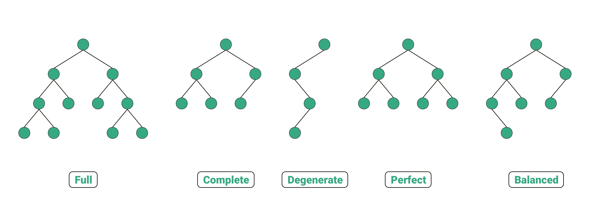

# Data Structure

## What is a data structure?

A data structure is a method for organizing and storing data in computers. It represents a collection of data values, the relationships between those values and the operations or functions they can deliver. Computer programmers use data structures to pass data to other components of an application or to a completely new application. The four primary functions of data structures are inputting, processing, maintaining and retrieving data.

## Array

### Introduction

An array is an arrangement of numbers, pictures or objects formatted into rows and columns according to their type. In coding and programming, an array is a collection of items, or data, stored in contiguous memory locations, also known as database systems. The purpose of an array is to <span style="background-color:yellow">**store multiple pieces of data of the same type together.**</span> You can use an array to demonstrate a mathematical property known as the commutative property of multiplication, which illustrates that you <span style="background-color:yellow">**can change the order**</span> of the factors or elements, and the product of the elements remains the same.<br>

In computer programming, an array can help you locate and identify where you stored each piece of data, or element, by adding an offset to each value. An offset is a number that represents the difference between the two indexes. Similar to an index in a book, an index in computer programming contains a record of entries with the names of the data items and their locations. Thus, you can <span style="background-color:yellow">**identify each element and its location by referring to the index within the array.**</span>

::: details What is an array's size?
An array’s size can be crucial in programming. Software developers and computer programmers use coding programming language, or C language, in a lot of their work, and arrays contain a <span style="background-color:yellow">**fixed-size amount of elements in C language.**</span> This means you're unable to expand or shrink an array because once you declare its elements, the software statistically allocates a designated amount of space for it.<br>

This is because if you create an array by directly initializing its values, the size of the array will be the exact number of elements you enter into it. If you remove or add an element, you're required to create a new array and enter the exact number of elements in your dataset.
:::

::: details What are the types of arrays?

### What are the types of arrays?

#### One-dimensional arrays

A one-dimensional array, also called a single-dimensional array, involves assessing the elements in sequential order, making it a linear array. You can assess this array according to the subscript of either a row or column index. In coding and programming, a subscript is a number or symbol programmers use to identify an element with an array.<br>

A one-dimensional array is a list of variables of similar data types and allows you to assess all the elements by referring to their index. In a one-dimensional array, you can represent several data items as a list.

#### Multidimensional arrays

Multidimensional arrays include two-dimensional and three-dimensional assemblages that you can use to implement matrices and various data structures. While one-dimensional arrays store a single list of elements, multidimensional arrays store lists-of-lists. They can represent multiple data items as a table with various rows and columns.
:::

::: details What are the advantages and disadvantages of using arrays?

### What are the advantages and disadvantages of using arrays?

#### Advantages of using arrays

- **Managing memory**: Because an array sorts various variables under a single name, arrays offer a <span style="background-color:yellow">**more efficient memory management strategy.**</span> The program could create a new variable for each element entered, but then items would be more difficult and time-consuming to locate, so search engines often use arrays to store and sort data.
- **Providing a single name for multiple variables**: A software designer may find it challenging to organize multiple variables without using a specific tool like an array. Arrays help maintain large sets of data under a single variable name to avoid confusion that can occur when using several variables.
- **Performing matrix operations**: Small and large databases may use one-dimensional or two-dimensional arrays to perform matrix operations. Some of these operations include addition and multiplication.
- **Implementing other data structures**: Programmers and software developers can use arrays to implement other data structures, including queues, heaps, stacks and hash tables.

#### Disadvantages of using arrays

- **Inflexible data values**: Because of the fixed and static sizing of arrays, the software requires you to create an additional array to alter the size of your dataset rather than adding to or subtracting from the one you've created. This can make your work more time-consuming, but you can avoid this by reviewing your data before creating an array.
- **Insertion and deletion challenges**: In addition to the fixed size of arrays, they also may present challenges with inserting or deleting data values. Because arrays store elements in consecutive memory features, deleting values and inserting new ones can be challenging, but you can avoid this issue by taking your time and carefully planning your data entries.
  :::

## Stacks

### Introduction

Stacks use a <span style="background-color:yellow">**last in, first out (LIFO)**</span> structure where the computer orders previous work with the last action appearing first. For instance, if you enter the dataset, "1, 2, 3, 4," the last digit, "4," would appear at the top. This type of data structure creates a pile or stack of information. A stack data structure is helpful when organizing information where the order of actions is important. The design of this structure helps you make sure you complete your task before moving on to a new one.
 <br>

## Queues

### Introduction

Contrary to stacks, queues follow a first in, first out (FIFO) structure for organizing data. This linear structure resembles a queue for waiting since information goes in and waits to be outputted. The information entered first is the first to leave the line. Computer programmers use queues to organize data that doesn't need to be processed immediately.
 <br>

## Linked Lists

### Introduction

A linked list is a fundamental data structure in computer science. It consists of nodes where each node contains data and a reference (link) to the next node in the sequence. This allows for dynamic memory allocation and efficient insertion and deletion operations compared to arrays.

In simple words, a linked list consists of nodes where each node contains a data field and a reference(link) to the next node in the list.

 <br>

## Binary trees

### Introduction

A binary tree is a non-linear structure that consists of nodes with two potential values or directions. The top node, or root, contains a right child and a left child. The different types of binary trees include:

- Rooted binary tree: Rooted binary trees have a root node, with every node having up to two children.
- Full binary tree: This type of binary tree occurs when every node has either zero or two children.
- Perfect binary tree: In a perfect binary tree, all interior nodes contain two children, and all external nodes, or leaves, have the same level.
- Complete binary tree: Complete binary trees occur when all levels except for the last are completely filled and nodes are located as far left as possible.
- Balanced binary tree: Balanced binary trees are ones where the left and right children's heights are different by at least one, the left child has a balanced amount and the right child has a balanced amount.
- Degenerate tree: In a degenerate tree, each parent node only has one child, representing a linked list.

Binary trees are helpful when reflecting structural relationships in data. They can also help represent hierarchies.
 <br>

## Graphs

### Introduction

A graph is an abstract data type (ADT) which consists of a set of objects that are <span style="background-color:yellow">**connected**</span> to each other via <span style="background-color:yellow">**links**</span> . The interconnected objects are represented by points termed as <span style="background-color:yellow">**vertices**</span>, and the links that connect the vertices are called <span style="background-color:yellow">**edges**</span>.

Formally, a graph is a pair of sets (V, E), where V is the set of vertices and E is the set of edges, connecting the pairs of vertices. Take a look at the following graph −

 <br>
In the above graph,

V = {a, b, c, d, e}

E = {ab, ac, bd, cd, de}

::: details Let's familiarize ourselves with some important terms

- Vertex − Each node of the graph is represented as a vertex. In the following example, the labeled circle represents vertices. Thus, A to G are vertices. We can represent them using an array as shown in the following image. Here A can be identified by index 0. B can be identified using index 1 and so on.

- Edge − Edge represents a path between two vertices or a line between two vertices. In the following example, the lines from A to B, B to C, and so on represents edges. We can use a two-dimensional array to represent an array as shown in the following image.
  :::

## Hash tables

### Introduction

Hash tables are a type of data structure in which the address/ index value of the data element is generated from a hash function. This enables very fast data access as the index value behaves as a key for the data value.

In other words, hash tables store key-value pairs but the key is generated through a hashing function. So the search and insertion function of a data element becomes much faster as the key values themselves become the index of the array which stores the data. During lookup, the key is hashed and the resulting hash indicates where the corresponding value is stored.
 <br>

## Skip lists

### Introduction

Skip lists are probabilistic data structures that list elements with a linked list. This type of structure is called a skip list because it skips several elements of an entire list. Each additional level in a skip list contains fewer elements, with no new elements. Skip lists are helpful for instances when programmers want to remove, insert and search for information quickly.
 <br>

<br>
<br>

```
Let's make the world a better place together :)
```
