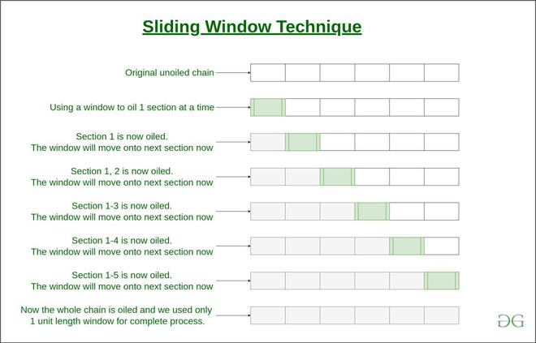

# Window Sliding Technique
Re-posted, the original post is at <a href="https://www.geeksforgeeks.org/window-sliding-technique/">here</a>

## Introduction

**Window Sliding Technique** is a computational technique that aims to reduce the use of nested loops and replace it with a single loop, thereby reducing the time complexity.

## What is a Sliding Window?

Consider a long chain connected together. Suppose you want to apply oil in the complete chain with your hands, without pouring the oil from above.

One way to do so is to: 
- pick some oil, 
- apply onto a section of the chain, 
- then again pick some oil
- then apply it to the next section where oil is not applied yet
- and so on till the complete chain is oiled.

Another way to do so is to use a cloth, dip it in oil, and then hold onto one end of the chain with this cloth. Then instead of re-dipping it again and again, just slide the cloth with your hand onto the next section, and next, and so on till the other end.

The second way is known as the **Sliding window technique** and the portion which is slid from one end to end is known as **Sliding Window**.

 <br>

## Prerequisite to use the Sliding window technique
The use of the Sliding Window technique can be done in a very specific scenario, where the **size of the window** for computation is **fixed** throughout the complete nested loop. Only then the time complexity can be reduced. 


## How to use Sliding Window Technique?
The general use of the Sliding window technique can be demonstrated as follows:

1. Find the size of the window required 
2. Compute the result for 1st window, i.e. from the start of the data structure
3. Then use a loop to slide the window by 1, and keep computing the result window by window.

## How to Know, Where we use the Sliding Window?
To know, Where we use the Sliding Window then we remember the following terms which is mentioned below:

`Array, String, Sub Array, Sub String, Largest Sum, Maximum Sum, Minimum Sum`

## Examples to illustrate the use of the Sliding window technique
Example: Given an array of integers of size ‘n’, Our aim is to calculate the maximum sum of ‘k’ consecutive elements in the array.

```
Input  : arr[] = {100, 200, 300, 400}, k = 2
Output : 700

Input  : arr[] = {1, 4, 2, 10, 23, 3, 1, 0, 20}, k = 4 
Output : 39
We get maximum sum by adding subarray {4, 2, 10, 23} of size 4.

Input  : arr[] = {2, 3}, k = 3
Output : Invalid
There is no subarray of size 3 as size of whole array is 2.
```


<code-group>
<code-block title="PHP">

```PHP
<?php
// O(n) solution for finding maximum sum of
// a subarray of size k
 
// Returns maximum sum in a 
// subarray of size k.
function maxSum( $arr, $n, $k)
{
    // n must be greater
    if ($n < $k)
    {
        echo "Invalid";
        return -1;
    }
 
    // Compute sum of first
    // window of size k
    $max_sum = 0;
    for($i = 0; $i < $k; $i++)
    $max_sum += $arr[$i];
 
    // Compute sums of remaining windows by
    // removing first element of previous
    // window and adding last element of
    // current window.
    $window_sum = $max_sum;
    for ($i = $k; $i < $n; $i++)
    {
        $window_sum += $arr[$i] - $arr[$i - $k];
        $max_sum = max($max_sum, $window_sum);
    }
 
    return $max_sum;
}
 
    // Driver code
    $arr = array(1, 4, 2, 10, 2, 3, 1, 0, 20);
    $k = 4;
    $n = count($arr);
    echo maxSum($arr, $n, $k);
 
?>
```
</code-block>

<code-block title="C#">

```csharp
// C# code for O(n) solution for finding
// maximum sum of a subarray of size k
using System;
 
class Example {
    // Returns maximum sum in
    // a subarray of size k.
    static int maxSum(int[] arr, int n, int k)
    {
 
        // n must be greater
        if (n < k) {
            Console.WriteLine("Invalid");
            return -1;
        }
 
        // Compute sum of first window of size k
        int max_sum = 0;
        for (int i = 0; i < k; i++)
            max_sum += arr[i];
 
        // Compute sums of remaining windows by
        // removing first element of previous
        // window and adding last element of
        // current window.
        int window_sum = max_sum;
        for (int i = k; i < n; i++) {
            window_sum += arr[i] - arr[i - k];
            max_sum = Math.Max(max_sum, window_sum);
        }
 
        return max_sum;
    }
 
    // Driver code
    public static void Main()
    {
        int[] arr = { 1, 4, 2, 10, 2, 3, 1, 0, 20 };
        int k = 4;
        int n = arr.Length;
        Console.WriteLine(maxSum(arr, n, k));
    }
}
```
</code-block>

<code-block title="JavaScript">

```js
// Javascript code for
// O(n) solution for finding
// maximum sum of a subarray
// of size k
function maxSum(arr, n, k) {
    let max = 0;
    let sum = 0;
    // find initial sum of first k elements
    for (let i = 0; i < k; i++) {
        sum += arr[i];
        max = sum;
    }
    // iterate the array once
    // and increment the right edge
    for (let i = k; i < n; i++) {
        sum += arr[i] - arr[i - k];
          
        // compare if sum is more than max,
        // if yes then replace
        // max with new sum value
        if (sum > max) {
            max = sum;
        }
    }
    return max;
}
 
// Driver code
let arr = [1, 4, 2, 10, 2, 3, 1, 0, 20];
let k = 4;
let n = arr.length;
document.write(maxSum(arr, n, k));
```

</code-block>
</code-group>

[Time to practice!](https://cheffyjonny.github.io/blog/Playground/longest-substring-without-repeating-characters)


```
Let's make the world a better place together :)
```

